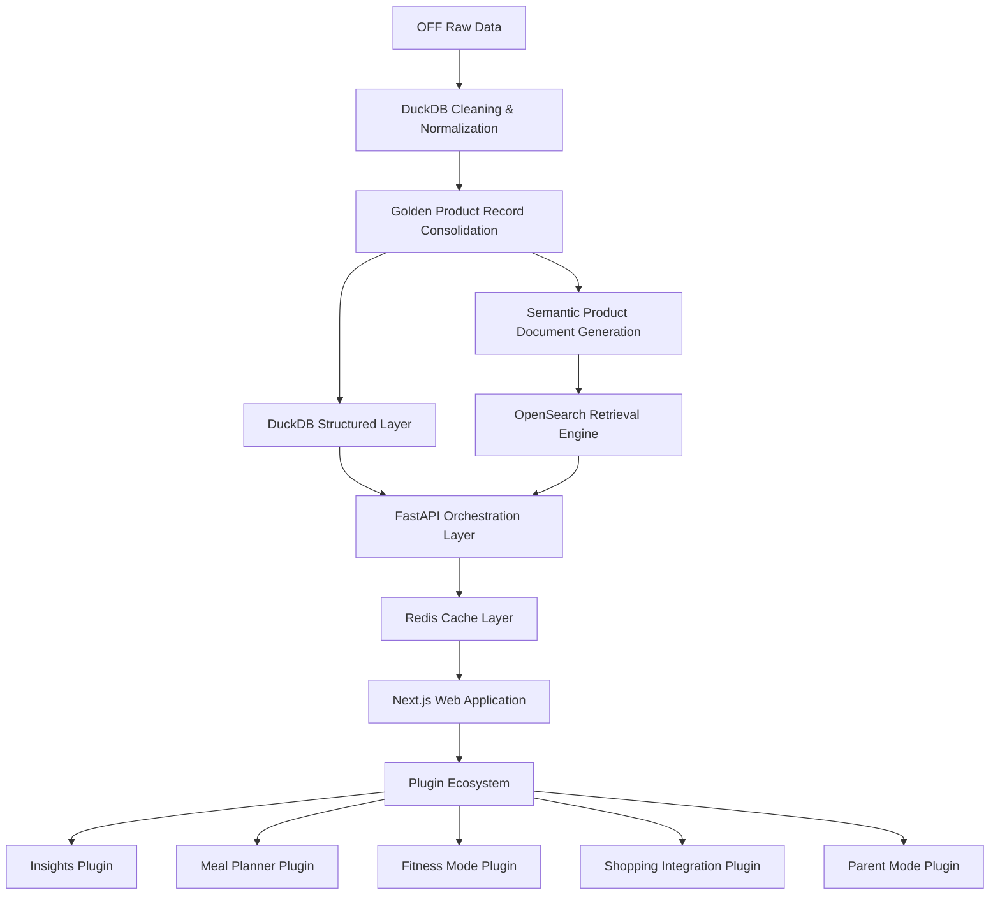

<div align="center">

# OFF-Canada-P3-Prototype

### Intelligent Food Retrieval & Discovery Platform for Open Food Facts Canada

A modern search and retrieval platform focused on food discovery, structured data processing, and scalable search experiences within the Open Food Facts Canada ecosystem.

---


</div>

---

# Overview

This repository represents an ongoing prototype and architecture exploration for **P3 — Intelligent Search & Retrieval Infrastructure** within the **Open Food Facts Canada** ecosystem.

The project explores modern approaches to food discovery by combining structured analytics, fast retrieval, and modular platform design.

Primary goals include:

- Intelligent food search
- Improved product discovery
- Hybrid retrieval workflows
- Clean and scalable architecture
- Plugin-based extensibility
- Better nutritional transparency
- Product comparison and recommendation experiences

---

# Vision

Traditional product search often exposes duplicated or inconsistent records.

This platform explores a cleaner retrieval approach through **Golden Product Records** — unified product representations built from normalized and consolidated Open Food Facts data.

## Golden Product Records

Golden records may include:

- Normalized product information
- Consolidated multilingual entries
- Unified nutrition data
- Structured semantic documents

This approach supports:

- Better search quality
- Cleaner comparisons
- More reliable recommendations
- Modular feature development
- Future intelligent retrieval workflows

---

# Architecture



# Technology Stack

| Layer | Technology |
|---|---|
| Frontend | Next.js + TailwindCSS + shadcn/ui |
| Backend | FastAPI |
| Search | OpenSearch |
| Analytics | DuckDB |
| Cache | Redis |
| Deployment | Docker |
| Architecture | Modular Plugin System |

---

# Search Architecture

The platform follows a **hybrid retrieval model**, combining search indexing and analytical querying.

## OpenSearch

Used for:

- Full-text search
- Fuzzy matching
- Typo tolerance
- Autocomplete
- Ranking
- Semantic retrieval experiments

## DuckDB

Used for:

- Structured filtering
- Nutrition analytics
- OLAP queries
- Aggregations
- Data exploration

This separation allows retrieval and analytics workloads to operate efficiently together.

---

# Planned Features

## Core Platform

- Smart Search
- Semantic Retrieval
- Product Comparisons
- Category Discovery
- Nutrition Filtering
- Recommendation Engine
- Search Explainability
- Health Insights
- Mobile Scanning
- Sustainable Food Discovery

---

# Plugin Ecosystem

The platform is designed with modular plugins so that new capabilities can evolve independently without affecting the core system.

### Example Plugins

- AI Assistant
- Fitness / Gym Mode
- Parent Mode
- Meal Planner
- Shopping Integrations
- Allergy Advisor
- Advanced Insights

---

# Semantic Product Documents

An important area of exploration is transforming structured product records into richer semantic documents.

Rather than relying only on raw schemas, products can also be represented in a more readable and context-aware format.

Example:

```yaml
Product: Kirkland Peanut Butter

Brand:
  Kirkland

Ingredients:
  - Dry roasted Valencia peanuts

Nutrition:
  Calories: 625 kcal / 100g
  Protein: 25g

Labels:
  - Kosher
  - No Added Sugar
```

Potential applications include:

- Context-aware retrieval
- Retrieval-augmented workflows
- Conversational food systems
- Improved product understanding

---

# UI / UX Direction

Current design exploration focuses on:

- Search-first experience
- Lightweight and accessible UI
- Open-source friendly design
- Plugin-ready interfaces
- Transparency-focused product pages
- Mobile-first usability

Design inspiration includes:

- Open Food Facts
- Notion
- Apple Health
- Linear
- Modern public data systems

---

# Product Experience Goals

## Search First

The platform prioritizes:

- Discovery
- Retrieval
- Comparison
- Better understanding of food products

## Transparent UX

Users should understand:

- Why results appear
- Product reasoning
- Nutritional context
- Ingredient analysis

## Modular Growth

The core platform remains:

- Lightweight
- Open
- Extensible

Advanced functionality can be introduced through independent plugins.

---

# Caching Strategy

Redis is currently planned for:

- Search caching
- Product caching
- Recommendation caching
- Trending query storage
- Future response caching workflows

---

# Repository Direction

At present, this repository serves as:

- Prototype workspace
- Architecture exploration
- UI / UX experimentation
- Retrieval research
- System design documentation

Future separation may include:

- `off-canada-platform`
- `off-search-engine`
- `off-plugin-sdk`
- `off-retrieval`
- `off-architecture-docs`

---

# Long-Term Direction

The broader objective is to build a modern food discovery platform that combines:

- Open nutritional data
- Reliable retrieval systems
- Structured product understanding
- Extensible architecture
- Scalable public food infrastructure

---

# Collaboration

This project is part of ongoing exploration and discussion around the Open Food Facts Canada ecosystem.

Feedback, architecture discussions, retrieval ideas, plugin concepts, and UI/UX suggestions are welcome.

---

# Status

**🚧 Active Prototype & Architecture Exploration**

Current areas of focus:

- Retrieval architecture
- OpenSearch experimentation
- Search workflows
- UI / UX direction
- Plugin ecosystem design
- Hybrid retrieval systems

---

<div align="center">

### 🌱 Building better food discovery through open data and modern search systems.

</div>